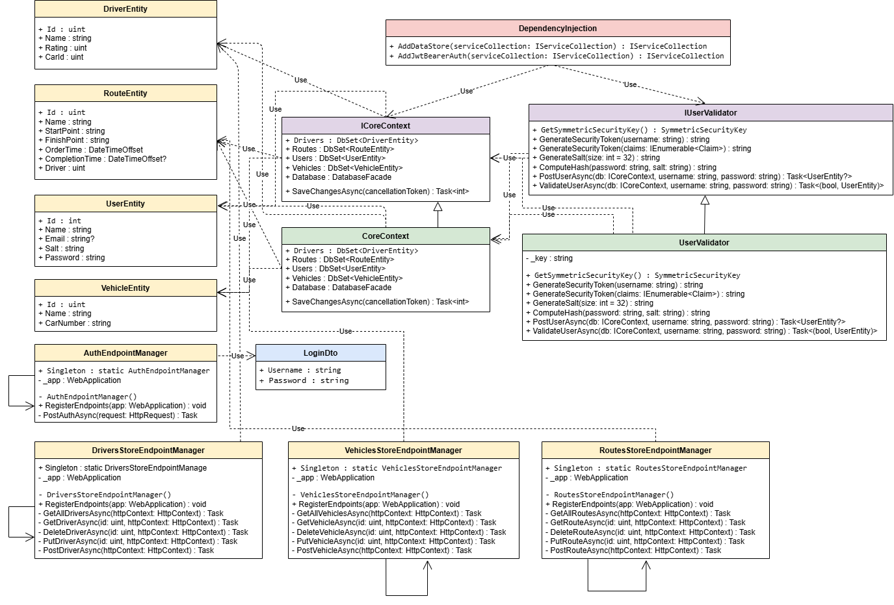

# AutoParkManagement (Система Управления Автопарком)
Комплексное веб-приложение, симулирующее управление автопарком, водителями и маршрутами. Проект построен на базе микросервисной архитектуры с использованием современных технологий контейнеризации, кэширования и мониторинга.

## Технологический стек

* **Backend:** C# / .NET 8 (Web API) 
  * **Поддерживаемая версия .NET SDK:** `8.0.403`
* **Frontend:** HTML5, CSS3, Vanilla JavaScript
* **База данных:** PostgreSQL 15
* **Кэширование:** Redis 7
* **Инфраструктура & Прокси:** Nginx, Docker, Docker Compose
* **Мониторинг:** Prometheus, Grafana
* **Безопасность:** JWT-аутентификация (HMAC-SHA256)

## Запуск проекта

Для локального развертывания системы убедитесь, что осуществляется поддержка **Docker** и **Docker compose**.

1. Склонируйте репозиторий.
2. В корневой директории проекта (где находится `docker-compose.yaml`) выполните команду:
   ```bash
   docker compose up --build -d
   ```
3. После успешного запуска сервисы будут доступны по следующим адресам:
    * **Клиентский портал (заказ авто):** `http://localhost/`
    * **Панель администратора:** `http://localhost/panel`
    * **Авторизация:** `http://localhostlogin`
    * **Мониторинг (Grafana):** `http://localhost:3000`

## Структура проекта

* `src/AutoParkManagement.App/` — Точка входа в приложение, Middleware, раздача статических файлов (`wwwroot`) и эндпоинты.
* `src/AutoParkManagement.Common/` — Общие контракты, интерфейсы и сущности базы данных (Entities).
* `src/AutoParkManagement.Implementations/` — Бизнес-логика, реализация валидации пользователей и взаимодействия с базой данных.
* `nginx.conf` / `prometheus.yml` — Конфигурационные файлы инфраструктуры.

## Система отношений классов (UML)
